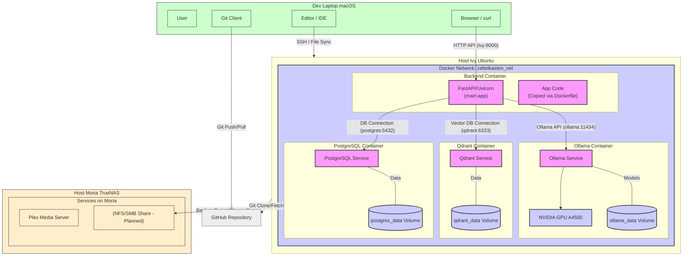

# Ivy Zettelkasten Project - System Architecture (Current State: Fully Containerized + AI Features)

This document outlines the current architecture of the Ivy Zettelkasten project, reflecting a fully containerized application stack with integrated AI features for semantic search, categorization suggestions, and summarization.

## Architecture Diagram (Mermaid)



## Key Components & Details

1.  **Ivy (Host):**
    *   Primary application and AI host running Ubuntu (with NVIDIA GPU).
    *   Runs the **Docker Engine** and **Docker Compose**.
    *   Hosts the entire application stack within Docker containers connected via the `zettelkasten_net` custom bridge network.

2.  **Docker Containers on Ivy (Managed by `docker-compose.yml`):**
    *   **`zettelkasten-backend`:**
        *   Runs the **FastAPI/Uvicorn** Python application.
        *   Built using the `backend/Dockerfile`. Application code is copied into the image.
        *   Connects to other services (`postgres`, `qdrant`, `ollama`) using their Docker service names over the internal network.
        *   Exposes port 8000 to the host, making the API accessible via `http://<ivy_ip>:8000`.
        *   Handles API requests, business logic, database interactions (SQLAlchemy), vector store interactions (Qdrant client), and calls to Ollama for AI tasks.
    *   **`zettelkasten-postgres`:**
        *   Runs **PostgreSQL** (v16) database.
        *   Data persists via a named Docker volume (`postgres_data`).
        *   Accessible internally to other containers on the network via service name `postgres` on port 5432.
    *   **`zettelkasten-qdrant`:**
        *   Runs **Qdrant** vector database.
        *   Data persists via a named Docker volume (`qdrant_data`).
        *   Accessible internally via service name `qdrant` on port 6333.
        *   Stores note embeddings and filterable metadata (e.g., `is_archived`, `memory_type`, `ai_suggested_type`).
    *   **`zettelkasten-ollama`:**
        *   Runs the **Ollama** service for hosting and serving LLMs.
        *   Models persist via a named Docker volume (`ollama_data`).
        *   Configured with **GPU passthrough** to utilize Ivy's NVIDIA GPU for accelerated model inference.
        *   Accessible internally via service name `ollama` on port 11434.
        *   Used by the backend to generate text embeddings, suggest memory types, and generate summaries.

3.  **Toottoot (Dev Machine):**
    *   Development environment (macOS).
    *   Interacts with the API running on Ivy via `http://<ivy_ip>:8000`.
    *   Manages the Git repository.
    *   Edits code on Ivy via VS Code Remote SSH.

4.  **GitHub:**
    *   Remote Git repository for version control.

5.  **Moria (Storage/Backup Target):**
    *   Runs TrueNAS.
    *   *Planned* target for automated backups of Docker volumes from Ivy (e.g., `postgres_data`, `qdrant_data`, `ollama_data`).

## Data Flow (Example: Note Creation with AI Features)

1.  User submits new note data via UI on Toottoot to `POST /notes/` at `http://<ivy_ip>:8000`.
2.  Docker forwards the request to the `zettelkasten-backend` container.
3.  FastAPI routes to `create_note_endpoint`.
4.  The endpoint calls `crud.note.create_note`.
5.  `crud.note.create_note`:
    a.  Saves initial note data to **PostgreSQL** (`postgres:5432`).
    b.  Calls `suggest_memory_type` service, which calls **Ollama** (`ollama:11434`) for categorization. The suggestion is saved back to PostgreSQL.
    c.  Calls `generate_note_summary` service, which calls **Ollama** (`ollama:11434`) for summarization. The summary is saved back to PostgreSQL.
    d.  Calls `get_embedding` service, which calls **Ollama** (`ollama:11434`) for text embedding.
    e.  Upserts the embedding and payload (including `ai_suggested_type`) to **Qdrant** (`qdrant:6333`).
    f.  Returns the complete (and now AI-enriched) SQLAlchemy `Note` object.
6.  The endpoint calls `logAiCategorizationFeedback` service, which saves feedback to **PostgreSQL**.
7.  FastAPI serializes the `Note` object (including AI suggestion dict and summary) using Pydantic `NoteRead` schema and sends the JSON response.
8.  UI (`app.js`) receives the response and updates the display.

## Implemented API Endpoints

*   `/` (Root - Serves UI)
*   `/ping` (Health check)
*   `/db-check/` (DB Connection Test)
*   `/static/*` (Serves static UI assets)
*   `/tags/` (`POST`, `GET` including name search)
*   `/tags/{tag_id}` (`GET`, `DELETE`)
*   `/notes/` (`POST`, `GET`)
*   `/notes/{note_id}` (`GET`, `PATCH`)
*   `/notes/{note_id}/archive` (`POST`)
*   `/notes/{note_id}/unarchive` (`POST`)
*   `/notes/{note_id}/permanent` (`DELETE`)
*   `/notes/{note_id}/tags` (`GET`)
*   `/notes/{note_id}/tags/{tag_id}` (`POST`, `DELETE`)
*   `/notes/{note_id}/links/outgoing` (`GET`)
*   `/notes/{note_id}/links/incoming` (`GET`)
*   `/notes/{source_note_id}/links/{target_note_id}` (`POST`, `DELETE`)
*   `/search/similar` (`POST`)
*   `/ai-tools/categorization-feedback` (`POST`)
*   `/test-embedding/` (`POST` - *Can be removed*)

## Next Steps Order (Plan)

1.  **Backend Refinements & AI Features:** (Current Focus)
    *   Error handling, logging (Structured).
    *   SQLAlchemy optimizations (relationship loading).
    *   AI-driven memory type categorization (refine prompts, confidence scores, user mode setting).
    *   Automated Link Discovery (multi-pass: explicit, semantic, LLM).
    *   Natural Language command processing (NLU).
    *   Backup strategy implementation.
2.  **UI Enhancements:**
    *   Styling (`styles.css`), tag management UI (search/create by name), link creation UI improvements, loading indicators, etc.
3.  **STT/TTS Integration:** Add voice interaction.
4.  **Native App Development:** Plan/build Swift frontends.
5.  **Testing:** Implement unit/integration tests.
```

The main changes here are in the "Key Components & Details" section, specifically point 2 ("Docker Containers on Ivy"), to accurately describe Ollama as a container with GPU passthrough on Ivy, and in the "Data Flow" section to show backend-to-Ollama communication happening via the `ollama` service name. The Mermaid diagram was already correct for this setup.

This should now be fully aligned with your current working state on Ivy.
